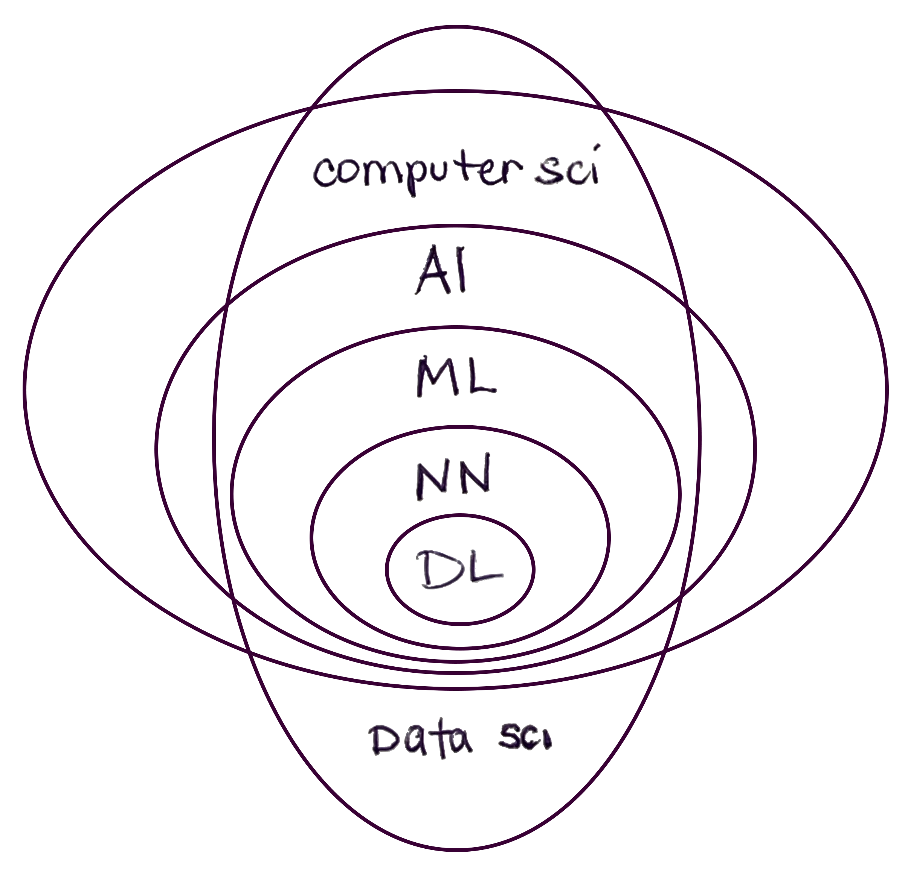

{::options parse_block_html="true" parse_span_html="true" /}

<!-- make web version a table, printable version a list glossary with two zine pages double sided? will mean having people update the work in 2 places to do so but will allow for words to be defined throughout the site dynamically -->

## Intersectional AI A-to-Z 

This glossary of terms for Intersectional AI A-to-Z is a great place to get started. By all means it's only one example of definitions for these complex ideas, and it is meant as an open invitation for conversations and amendments! These concepts show the complexity of the topic seen from multiple angles; yet it is so important to try to break down these concepts into plain language in order to offer more openings for folks to join these conversations. Please chime in, ask questions, help make these definitions better!

via [Elements of AI](https://course.elementsofai.com/1/1):
>"When defining and talking about AI we have to be cautious as many of the words that we use can be quite misleading. Common examples are learning, understanding, and intelligence. [...]

<!-- {: .small .float-right} -->

<!-- <caption>AI terms are easy to mix up. AI is a subset of the field of computer science. Within it, machine learning is the technique that is commonly used currently and which includes a variety of practices within it, like deep learning, much of which is discussed here. Almost all of these make use of work from data science, a separate but highly related field.</caption>{: .fs-2 .small .float-right} -->

PRINT THIS: | [See Side One](../GlossarySideA) | [See Side Two](../GlossarySideB)
**A** | **[artificial intelligence](../GlossarySideA/#artificial-intelligence)** | **[artificial intelligence](../GlossarySideB/#artificial-intelligence)** 
**B** | **[bias & variance](../GlossarySideA/#bias--variance)** | **[bias (implicit)](../GlossarySideB/#bias-implicit)** 
**C** | **[confidence interval](../GlossarySideA/#confidence-interval)** | **[code of conduct](../GlossarySideB/#code-of-conduct)**
**D** | **[data cleaning](../GlossarySideA/#data-cleaning)** | **[data colonialism](../GlossarySideB/#data-colonialism)** 
E | **[explainability](../GlossarySideA/#explainability)** | embodiment? / (digital) epidermalization? / emotion? / **[ethical AI](../GlossarySideB/#explainable-AI)** (for public good etc)
F | **[feature extraction](../GlossarySideA/#feature-extraction)** | **[FLOSS](../GlossarySideB/#FLOSS)**
G | **[GANs](../GlossarySideA/#GANs)** | ????
**H** | **[hyperparameter](../GlossarySideA/#hyperparameter)**| **[heteronormative](../GlossarySideB/#heteronormative)**
**I** | **[information](../GlossarySideA/#information)** (signal/noise, Shannon) | **[information](../GlossarySideB/#information)**(situated, embodied) ..and or intelligence
**J** | **[Javascript](../GlossarySideA/#Javascript)** | **[Justice, transformative](../GlossarySideB/#justice-transformative)** 
K | **k-means, KNN** | Kimberlé Crenshaw? 
L | **loss function** | Lovelace et al
M | **machine learning** / Markov chain | makerspace / materiality 
N | **[neural net](../GlossarySideA/#neural-net)** | **[nonbinary](../GlossarySideB/#nonbinary)** 
O | **[overfitting & underfitting](../GlossarySideA/#overfitting--underfitting)** | **[othering](../GlossarySideB/#othering)**
P | **[Python](../GlossarySidea/#Python)** / parameter / pattern recognition | privacy (GDPR?) / power
**Q** | **quantification (quantifier)** | **queer (theory)** 
**R** | **regression vs classification** | **race (as a technology) & racialization** 
S | **supervised vs unsupervised** | **sustainability** / situated / standpoint theory
**T** | **transformer**/transfer learning | **trans* rights (turing test) / transfeminism / transhuman**
U | **uncertainty** | **unknowability** 
V | **value/variable** / variance / vision | **value**??
W | **(bag-of-)words** (w nlp) | **white supremacy / white feminism**
X | "x" as input? | xenofeminism
Y | "y" as output? | ?yt-ness ? 
Z | ???? | zines
PRINT THIS | [See Side One](../GlossarySideA) | [See Side Two](../GlossarySideB)

### Other Glossaries, Inspiration, Resources

* [You and AI Festival Glossary](https://www.onassis.org/whats-on/festival-you-and-ai-through-the-algorithmic-lens/exhibition/glossary) and [Bibliography](https://www.onassis.org/whats-on/festival-you-and-ai-through-the-algorithmic-lens/survival-guide-)
* [A New AI Lexicon](https://medium.com/a-new-ai-lexicon/)
* [An AI Glossary](https://www.nytimes.com/2018/10/18/business/an-ai-glossary.html)
<!-- *  -->

<!-- via [Elements of AI](https://course.elementsofai.com/1/1): -->
<!-- > "properties that are characteristic to AI, in this case autonomy and adaptivity...  -->

<!-- > Adaptivity; The ability to improve performance by learning from experience. -->
<!-- >"intelligence is not a single dimension like temperature." -->

<!-- 
**A** | algorithm / **adversarial network (&GAN)** / api / abstraction | **adversity** / agency / anonymity / autonomy / access / accountability 
**B** | **bias** (technical w/variance)	/ black box | **bias** (social)
**C** | convolutional neural net / **confidence interval** / clustering / cybernetics | care / **code of conduct** / community / critical race theory
**D** | **data cleaning** / decision boundary / deep learning | DEI / **data colonialism** 
E | ethical AI??? / evolutionary algorithms / **explainability** / encapsulation | embodiment / digital epidermalization / emotion / ethical AI (for public good etc)
F | forking / **feature** extraction/selection (variables) | **FLOSS** / feminist / fairness / fascist
G | **gpt3** / GAN 	| gender **essentialism** / global north
**H** | **hyperparameter**	/ hidden layer | histories of computing / heteronormative / **hackerspace**
**I** | interface / image recognition / intelligent assistant (virtual/chatbot) imageNet(Roulette)/ **information** | **information** (again/instead?) / intersectionality
**J** | **Javascript** (vs Java?) | **Justice, transformative** 
K | **k-means, KNN** | Kimberlé Crenshaw? / 
L | long short-term memory (LSTM) / linear regression / **loss function** | Lovelace et al
M | **machine learning** / Markov chain | makerspace / materiality 
N | nlp & nlg & nlu / nft / **neural net** | **nonbinary** / 'neutral'
O | **overfitting & underfitting** / **othering** / open-source/floss or F? / OOP | otherness / OOO / ??
P | Python / parameter / pattern recognition | privacy (GDPR?) / power
**Q** | **quantification (quantifier)** / query language | **queer (theory)** 
**R** | **regression vs classification** / recommender system / RNNs / reinforcement learning | **race (as a technology) & racialization** 
S | **supervised vs unsupervised** / sentiment analysis / strong/weak general/narrow AI / search algo / swarm / software | **sustainability** / situated / standpoint theory
**T** | tensor / **transformer**/transfer learning / turing test / training vs test data	| **trans* rights  (turing test connects these?) / transfeminism / transhuman**
U | **uncertainty** / unix** &linux | | **unknowability** / union (labor) / user-creator / ?? 
V | **value/variable** / variance / vision | **value**????
W | **(bag-of-)words** / ? | **white supremacy / white feminism**
X | x as input? | xenofeminism
Y | y as output? | ?
Z | ? | zines (publishing practices)
 -->