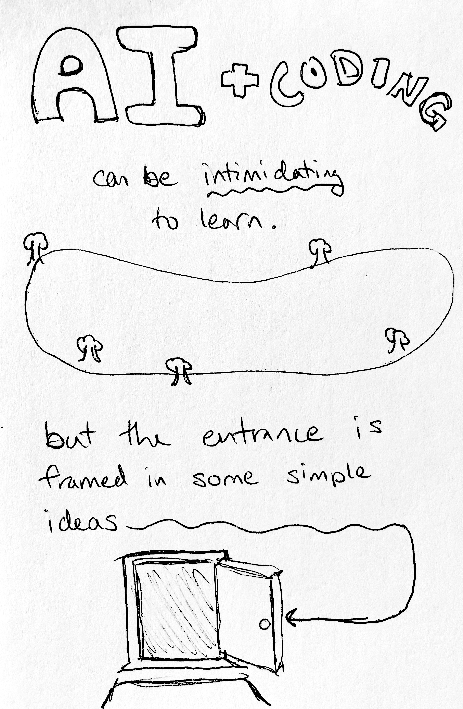
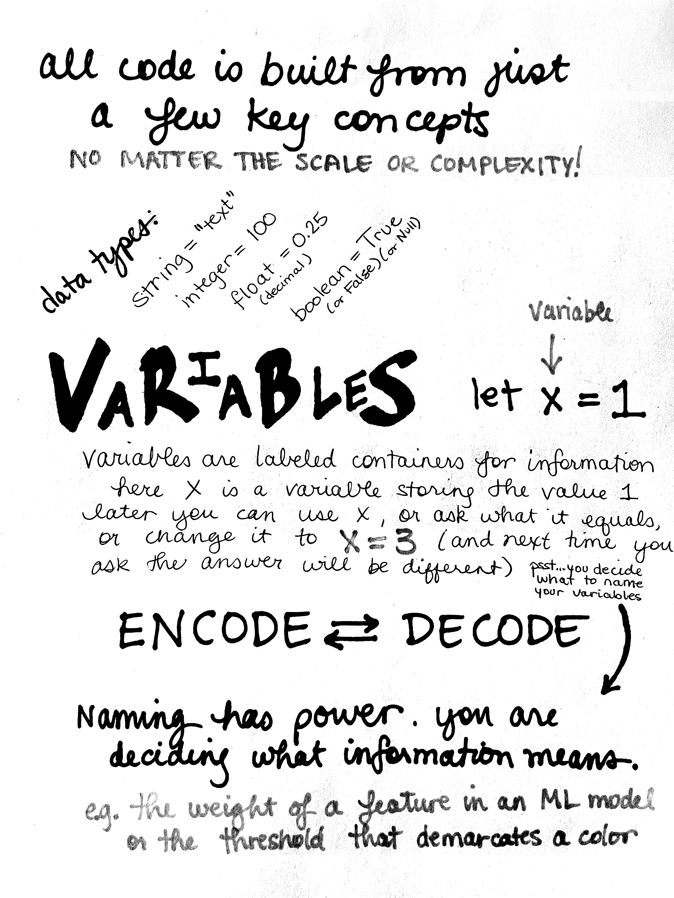
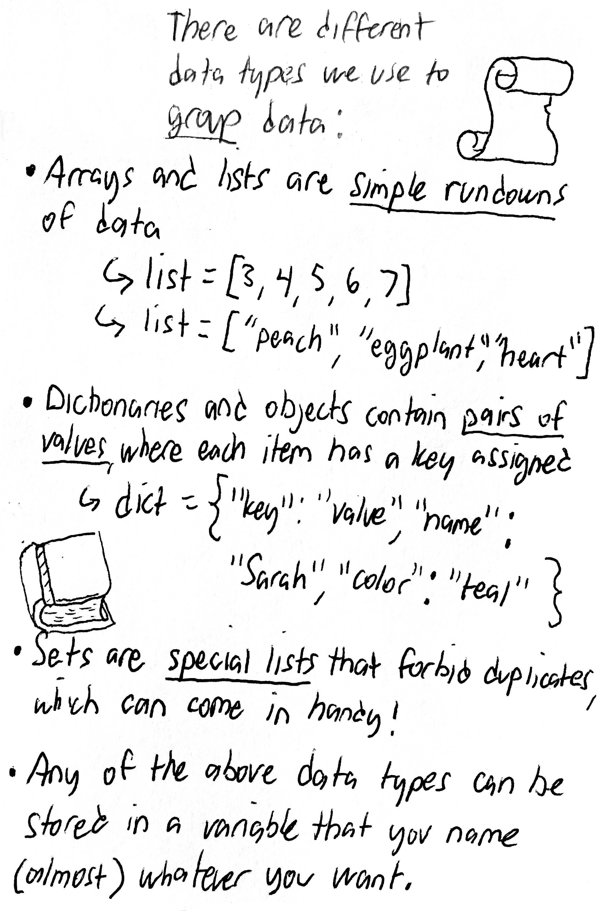
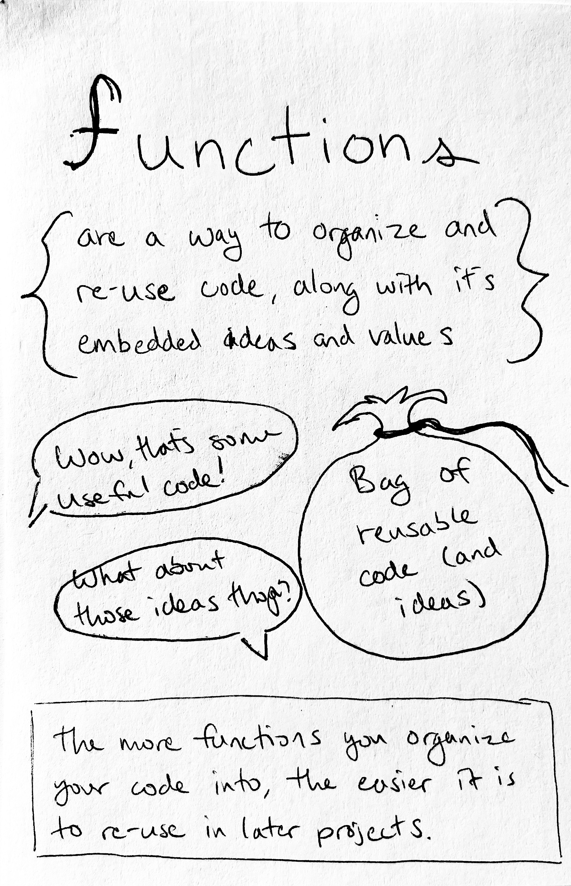
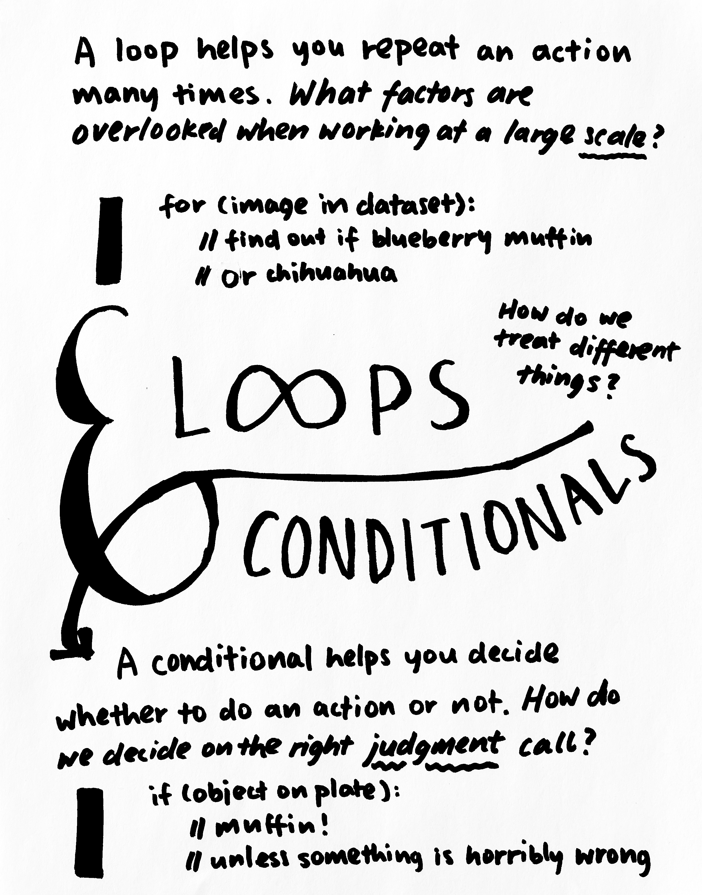
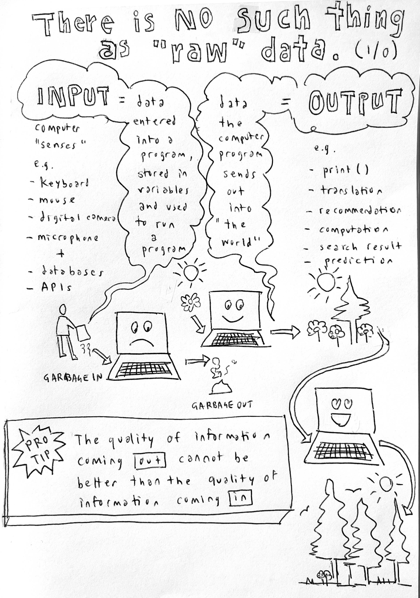

{::options parse_block_html="true" parse_span_html="true" /}

<div id="preview">
<canvas id="pdf-canvas" data-url="../../assets/files/IAIWorkshopCodeCol-Digital.pdf"></canvas>
<br>
<button id="prev">last</button>
<button id="next">next</button>
<span>Page: <span id="page_num"></span> / <span id="page_count"></span></span>
</div>

<main class="zine">
<section class="zine-page page-1" markdown="1">

# 😍 Help Me Code Intersectional AI

<!-- ### Code Basics for Cuties of All Kinds Who Want to Save AI -->

<!-- {: .img-small } -->
<!-- {: .img-small } -->

## Don't let { curly braces } intimidate you -- let's jump in!

## All Programs Combine Just a Few Basic Concepts

AI and coding can be intimidating to learn. But the entrance is framed in some simple ideas.

All code combines just a few key components—no matter the scale or complexity! Anything you want to build will be composed of these pieces layered together.

## Data

Data are pieces of input to the machine. They are the information you are giving, manipulating, and getting back out.

Data types are all the different kinds of information you can store. Some languages ask you to specify which kind of variable you're creating, like Javascript. Others, like Python, can tell just by how the data is formatted. 

**Strings** are simple lines of text (always seen in between single or double quotation marks). 

**Numbers** include **integers** aka whole numbers like 100; **floats** are numbers with decimals like 0.25; sometimes other kinds too.

**Booleans** are either `True` or `False` (or a sneaky `NULL`).

## Variables 

Variables are labeled containers for information. They are placeholders you can name and store things in to recall for later. Let's say `let x = 1`. That means we declared `x` is a variable storing the data `1`. Later we can ask, "What was `x`?" or say, "Change `x = 3` now." (And then next time we ask what `x` equals, the answer will be different.)

#### Naming has power. ENCODE <><> DECODE

*Pssst... you decide what to name your variables.*

You are deciding what information means. e.g. the weight of a feature in a machine learning model or the threshold that demarcates one color from another.

<!-- {: .img-small } -->
<!-- {: .img-small } -->

### Data in Groups

There are different data types we use to *group* collections of data together. They each have different benefits:

**Arrays** AKA **Lists** are simple run downs of data. They can usually be of any length and be of any kind of data: 
  * `numberList = [3, 4, 5, 6]`
  * `emojiList = ["peach", "eggplant", "heart"]`
  * `mixedList = ["peach", 33, "heart", True, 0.314159]`
**Dictionaries** contain *pairs of information*, where each pair has a *key* and a *value* assigned to match, like a label for each piece of info:
  * `dict = {"key": "value", "name": "Sarah", "color": "teal"}`
**Sets** are special lists that forbid duplicates, which can sometimes come in handy!

Any of the above data types can be stored in a variable that you name (almost whatever you want).

## Action! Calculations & Operations

Now that you've got some data in your program, time to do something with it! One of the main things programs do is make calculations on data using mathematical operations like add, subtract, multiply, divide, etc. (`+ - * /`), as well as Boolean operations that act as filters, for example AND (`&&`) and OR (`||`).

## Functions: Take It with You

Functions are a way to organize and reuse code, along with its embedded ideas and values. Like putting snippets of code and ideas in a bag. 

>> Wow that's some useful code!

>> What about those ideas, though? 

The more you organize your code into functions, the easier it is to reuse in later projects. And guess what, you also save your functions with almost any variable name you want!

Like variables, functions store stuff, but instead they can save a whole phrase that expresses an action. They can execute and act on whatever data you feed into them when you put them to work later. 

<!-- by using some placeholder variables that get replaced by the data you feed in when you run the function later on. Make sense yet? It will help to try an example: -->

The best (and sometimes *worst*) part about computation is that it's designed to make patterns to apply to multiple situations. 

<!-- {: .img-small } -->
<!-- {: .img-small } -->

## Do It Again! Loops & Conditionals

A **loop** helps you repeat an action many times. 

>What factors are overlooked when working at a large scale?

```python
for (image in dataset):
    // find out if blueberry muffin
    // or chihuahua
```

>How do we treat different things? 

A **conditional** helps you decide whether to do an action or not. 

>How do you decide on the right judgment call? 

```python
if (object on plate):
    //muffin!
    //unless SOMETHING is horribly wrong
```
Computers can compound decision-making work at high speed and great volume, allowing for amazing automation but also enormous, unforeseen ethical impacts.

<!-- > if/then and if/else -->

<!-- >for loops for (let i=0; i<list.length;i++){} and for (let l in list){} -->

<!-- >try/catch and the dreaded while loop -->

## NO SUCH THING AS RAW DATA

 **Input** | **Output**
Data entered into a program, stored in variables, used and modified when the program is run. | Data the program sends out into "the world." 
e.g. from sensors, keyboard, mouse, camera, microphone, database, API | e.g. `print()`, translation, recommendation, calculation, search result, prediction

**Pro Tip:** The quality of the information coming out cannot be better than the quality of the information coming in.

#### Garbage in, garbage out

### This issue was created during a zine workshop on Nov 13, 2021 with Creative Code Collective participants and community.

</section>

<hr>
<hr>


<section class="zine-page page-2" markdown="1">

<!-- #### Earlier Draft Notes

####  I Know NO Code: Where Do I Even Start? Help!! (Starter, How-Tos for Artists & Activists)

### Why Would I Learn to Code? -->

</section>

<section class="zine-page page-3" markdown="1">

<!-- ### Attitude: Fierce & Scrappy

### Overwhelm: Languages, Tools, Libraries, Oh My

### Which tools for which jobs?

#### Demistifying -->


</section>

<section class="zine-page page-4" markdown="1">

</section>

<section class="zine-page page-5" markdown="1">
</section>

<section class="zine-page page-6" markdown="1">
</section>

<section class="zine-page page-7" markdown="1">
</section>

<section class="zine-page page-8" markdown="1">

<!-- ### References -->

 <!--{: .img-small} -->

### Resources
*Don't stop, don't give up!*

Keep Going! Where to look next? 

[Creative Code Collective, Resource Hub](https://creativecodecollective.github.io/resource-hub/)

[Sharon Lee De La Cruz: Can computers understand slang?](https://www.youtube.com/watch?v=CFT6w9NKfCs)
Code Slang: crowdsourced library, flexible, visual output. "Retaining a culture, meeting people where they're at, celebrating the way we communicate."
& the [Digital Citizens Lab]() 
<!-- all dead links? -->

[Aesthetic Programming](https://aesthetic-programming.net/)
[Exploratory Programming for the Arts and Humanities, 2nd Ed](https://mitpress.ublish.com/ereader/12629?preview=#page/i)

</section>
</main>

<script src="//mozilla.github.io/pdf.js/build/pdf.js"></script>
<script src="../../assets/js/loadpdf.js">


<!-- references -->

<!-- ```
data: types include...
    strings (text)
    numbers (float/integer)
    groups: list, dictionary, etc. (AKA array)
    booleans: (true/false)
groups of data:
    arrays/lists
    dictionaries/objects
    sets & tuples
variables (labeled containers for the above data)
calculations & operations
decisions & loops
	if/then
	for loops, while loops, etc.
functions & classes (labeled containers for actions)
modules / libraries
``` -->