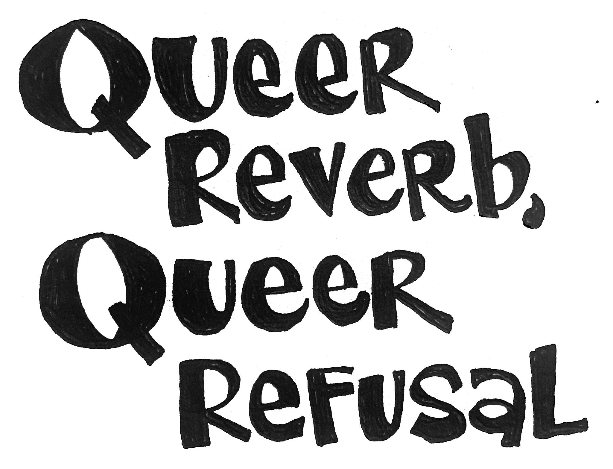

<main class="zine">
<section class="zine-page page-1" markdown="1">

## Tactics for Intersectional AI

{: .img-small }
{: .img-small }

### So You Want to Make Better AI: Practical Strategies
#### No coding required, bring your friends

</section>

<section class="zine-page page-2" markdown="1">

### Black feminist ethics & tactics

- guest authors []
  
</section>

<section class="zine-page page-3" markdown="1">

### Embodying anti-white-supremacist values

</section>

<section class="zine-page page-4" markdown="1">

### 7 tenants of data feminism
  
  > "all work in the world, is undertaken by individuals. [...] Rather than viewing these postionalities as threats or as influences that might have biased our work, we embraced them as offering a set of valuable perspectives that could frame our work." (D'Ignazio & Klein 83)

</section>

<section class="zine-page page-5" markdown="1">

  4. Hosting a feminist server
  7.  How ~~not~~ to structure your hacker organization
  6. AI as a craft, nonviolent creative code, CCC
  8.  Types of creative-critical-code interventions: what can you imagine? what will you make?
  9.  Because we could imagine it differently
      1.  Distributed computing, federated networks then & now 
      2.  [The Contingent Internet](https://dspace.mit.edu/bitstream/handle/1721.1/115284/daed_a_00361.pdf?sequence=1&isAllowed=y) via Jeanette Hofmann's work
  10. 

</section>

<section class="zine-page page-6" markdown="1">

### Crip Codes & Indigenous AI with Luke Fischbeck

ethical commitment to accessibility 
and also, margin to center supporting all
and also, shaping AI broadly

</section>

<section class="zine-page page-7" markdown="1">

### Queer reverb, queer refusal

{: .img-small }

</section>

<section class="zine-page page-8" markdown="1">

### AI To-Do List

### [How to Write Non-Violent Creative Code](https://contributors-zine.p5js.org/#reflection-olivia-mckayla-ross)
#### P5 contributors facilitated by [Olivia McKayla Ross]()

</section>
</main>