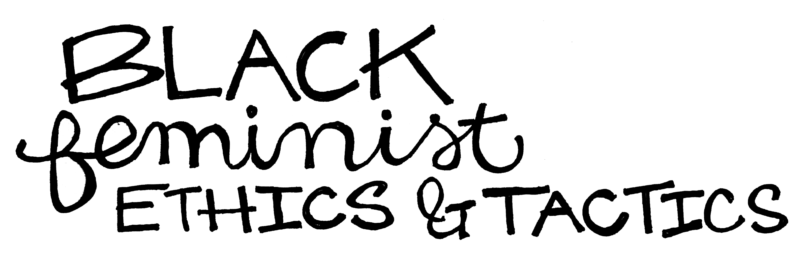

{::options parse_block_html="true" parse_span_html="true" /}

<main class="zine">
<section class="zine-page page-1" markdown="1">

## Tactics for Intersectional AI

{: .img-small }
{: .img-small }

>"Pranking an AI—giving it a task and watching it fail—is a great way to learn about it" (Shane 2019, 4).

### So You Want to Make Better AI: Practical Strategies
#### No coding required, bring your friends

</section>

<section class="zine-page page-2" markdown="1">

### To Do List

Keep in mind the following goals:

- know it’s about power
- stay self-reflexive, polyvocal, multimodal
- add back error, uncertainty, entanglement
- combine tech & dialogue
- entwine data, design, & community
- embrace a meta ethics of multiplicity & relation
- decenter European values & knowledge (and its own origin stories)
- de-digitize sometimes
- focus on infrastructures of care: mutual aid, start low & go slow
- apply to every level in the stack, every step in the process
- let intersectionality guide aesthetics, tactics, and ethics

### Black feminist ethics & tactics

- guest authors []

The work by women of color is at the core of an intersectional critical practice. Safyia U. Noble, Brendesha Tynes, and Joshua Schuschke (2016) argue that founders of Black Lives Matter, three queer Black women, demonstrate community coalition-building skills applicable to digital spaces: “the movement’s reflexivity, the ability to counter hegemonic narratives, and self-care are key components of digital intersectionality. By modeling the standard of reflexivity, the movement is able to critique and correct its own narrative and practices” (28). This self-reflexivity is key to be able to adapt to changing circumstances as well as to the needs of the people your technologies are hoping to serve.

since this isn’t my subject position or expertise area, here would be a great place to let other voices shine!
  
</section>

<section class="zine-page page-3" markdown="1">

### Indigenous Knowledge Systems in Technology

...tbd...
via Katherine Yang

[Angie Abdilla, Robert Fitch:  Indigenous Knowledge Systems and Pattern Thinking](https://opus.lib.uts.edu.au/bitstream/10453/124435/1/FCJ-209AbdillaFitch.pdf)

[Indigenous Knowledge Systems in Technology](https://kgt.dev/iks/)

</section>

<section class="zine-page page-4" markdown="1">

### 7 tenants of data feminism
  
  > "all work in the world, is undertaken by individuals. [...] Rather than viewing these postionalities as threats or as influences that might have biased our work, we embraced them as offering a set of valuable perspectives that could frame our work." (D'Ignazio & Klein 83)

from Catherine D’Ignazio and Lauren Klein’s (2019) book of the same name:

1. examine power
2. challenge power
3. elevate emotion and embodiment, valuing multiple forms of knowledge 
4. rethink binaries and hierarchies
5. embrace multiple perspectives, prioritizing local, indigenous, and experiential knowing
6. consider context: “data are not neutral or objective. They are the products of unequal social relations, and this context is essential for conducting accurate, ethical analysis”
7. make labor visible so it can be valued

</section>

<section class="zine-page page-5" markdown="1">

### Hosting a feminist server

Because it offers material access and control, running a “feminist server” can be a form of activism (anarchoserver.org via Dunbar-Hester 2020, 113–114). “For example, on the radical left, the group Riseup devotes server space to mirroring content for social justice organizations on at least three continents” (113). Some of the “principles for design and operation” include:

- avoids efficiency, ease-of-use, scaleability, and immediacy because they can be traps
- knows that networking is actually an awkward, promiscuous, parasitic practice
- does not confuse safety with security, risks exposing her insecurity
- tries not to apologize when she is unavailable

### How ~~not~~ to structure your hacker organization

Tips from Hacking Diversity by Christina Dunbar-Hester:

#### But I want everyone to feel good, so no one should be in charge, right?

Rather than “shelving hierarchy entirely,” many BIPOC and LGBTQ/feminist hackerspaces prefer “an accountable, transparent hierarchy” that is “as horizontal and distributed as possible, instead of having unofficial leaders “who govern through “charisma, reputational capital or technical prowess. […] A culture of valorizing technology itself, and especially granting certain people star status through their technical prowess and willingness to claim credit for technical accomplishments, [is] part of the problem” (89).

#### Should I work within existing structures or create my own?

“Many advocates pursue both mainstream intervention and separate spaces simultaneously, recognizing that each has utility and that it is not an either/or situation” (70).

#### What’s important to know in working with others?

Prioritize clear documentation (and other skills valued besides just ‘hard coding’) and “collectivized communicability” as part of your politics (82–83).

#### Isn’t the barrier to entry to high to even try?

“[It’s] ‘not patronizing to meet people where they’re at. […] Find a device you already use, take out the proprietary crap that controls it, and control it yourself’” (108).

For more ideas for community guidelines, like “no well-actuallys, no feigning surprise, no backseat driving, no subtle -isms,” check out Recurse.

### AI as a craft

Could contemporary AI work draw on the work of feminist handmade media makers and the long histories of feminine and indigenous handcraft practices? Three qualities these works often share, which

embodied, often literally using the body or investigating the situated/particular self in concrete ways
continually iterative, slow and explorative, rather than strictly goal-oriented
community-focused, often in domestic or caretaking spaces, work that is functioning or proving as well as expressing

### How to Write Non-Violent Creative Code

“honor the land, honor the body, honor the small, honor the exchange” [p5.js Contributors Conference](https://docs.google.com/presentation/d/19xxc2zWWdFMAQjT6tRdN5ZU13vAKSwM7jojaC2U4F6Q/edit#slide=id.g5fc8f78ea6_1_99)

More context on the development of this from [Olivia McKayla Ross](https://contributors-zine.p5js.org/#reflection-olivia-mckayla-ross)

**maybe Q expand?**

### Types of creative-critical-code interventions: what can you imagine? what will you make?

* **Inform**: provide or reveal information that already exists or is hidden
* **Challenge**: disrupt, troll, converse, intervene, activate, ask questions
* **Reimagine**: redesign, reframe, recontextualize, sketch out
* **Reflect**: aesthetic, artistic, affective, contemplative, essayistic
* **Resource**: convene, make space, provide access, provide goods or services, teach or share, ask (someone else might need the same thing)

>“Database design, in that way, is “an exercise in worldbuilding,” a normative process in which programmers are in a position to project their world views—a process that all too often reproduces the technology of race.” –Ruja Benjamin, Race After Technology (54)

>“a project may be feminist in content, in that it challenges power by choice of subject matter; in form, in that it challenges power by shifting the aesthetic and/or sensory registers of data communication; and/or in process, in that it challenges power by building participatory, inclusive processes of knowledge production. What unites this broad scope of data-based work is a commitment to action and a desire to remake the world.” –Catherine D’Ignazio & Lauren Klein, Data Feminism (18)

### Because we could imagine it differently

1.  Distributed computing, federated networks then & now 
2.  [The Contingent Internet](https://dspace.mit.edu/bitstream/handle/1721.1/115284/daed_a_00361.pdf?sequence=1&isAllowed=y) via Jeanette Hofmann's work 

</section>

<section class="zine-page page-6" markdown="1">

### Crip Codes & Indigenous AI with Luke Fischbeck

ethical commitment to accessibility 
and also, margin to center supporting all
and also, shaping AI broadly

</section>

<section class="zine-page page-7" markdown="1">

### Queer reverb, queer refusal

{: .img-small }

Rather than assuming the goal for all systems is more visibility and more access, different approaches to AI could incorporate queer, feminist, anti-racist theories that understand some folks have other goals, even answering Gaboury’s question: “how can we enact disappearance in such a way that does not erase difference?” (147). Citing black data, alongside “queer opacity [and] queer darkness as not only an aesthetic but an ethos” and calls for “forms of life that account for refusal as a situated practice—one that is explicitly raced and embodied, even as it would prefer not to articulate the situatedness of any single identity form” (148). This is not just resistance “but a refusal of the very terms of engagement” (149).

Gaboury offers a concrete example of how code can undermine the binaries it constructs: “The use of NULL [in place of a valid answer in a database] marks an indeterminate mode of being that is at once within and outside, part of and illegible to a discrete system of relations, a ‘middle’ that explicitly marks an indeterminate, incalculable, unknown state of being” (153). NULL is not zero or blank, nor is it quite an answer (like, say, male/female) that conforms to the field. It marks the inability to be known—“an excessive illegibility […] within an otherwise normative system of relations” (153) and “a tactic of negotiated visibility that removes itself from the productive logic of the system that would seek to identify it” (154).

If not indeterminate, then in looping, reverberating, proliferating refrain: Alexander Cho (2015) says, “if queer temporality is the condition, then refrain is the mechanics” (52). Cho points to Tumblr’s “nonlinear, atemporal rhizomal exchange of affect and sensation, a ‘queer reverb’ of repeat and repeat; and there may be a possibility for this sort of transmission to buoy an anti-normative or resistant politics” (47).

</section>

<section class="zine-page page-8" markdown="1">

### CREATIVE CODE COLLECTIVE

MA+P’s Creative Code Collective values include (and we continue to develop these in community):

* cooperation not competition
* scrappy artistic strategies not perfect code
* creativity as collective wayfinding
* project-based and process-oriented
* growth not perfection

</section>
</main>

*[black data]: Gaboury cites Shaka McGlotten’s concept of ‘black data’, and the dehumanization of black and queer life to construct and stabilize the white political techno subject, which I want to read up on next. “Centering black and queer life […] offers a radical reformulation of the subtractive mode offered by the NULL marker as a technological form, that is, as a tactic of negotiated visibility that removes itself from the productive logic of the system that would seek to identify it.” (Gaboury 2018, 154)

<!-- references -->
<!-- field3 -->
*[Ahmed]: Ahmed, Sara. 2006. Queer Phenomenology; —. 2017. Living a Feminist Life.
*[Adam]: Adam, Alison. 1998. Artificial Knowing: Gender and the Thinking Machine.
*[Apprich]: Apprich, Clemens, Wendy Hui Kyong Chun, Florian Cramer, & Hito Steyerl. 2018. Pattern Discrimination.
*[Benjamin]: Benjamin, Ruha. 2019. _Race After Technology: Abolitionist Tools for the New Jim Code._
*[D’Ignazio & Klein]: D’Ignazio, Catherine, and Lauren Klein. 2019. Data Feminism.
*[Klein]: D’Ignazio, Catherine, and Lauren Klein. 2019. _Data Feminism_; Posner, Miriam and Lauren Klein. 2017. “Data as Media.” _Feminist Media Histories_.
*[Dunbar-Hester]: Dunbar-Hester, Christina. 2020. _Hacking Diversity: The Politics of Inclusion in Open Technology Cultures._
*[McPherson]: McPherson, Tara. 2018. _Feminist in a Software Lab._ 
*[Noble]: Noble, Safiya Umoja. 2018. _Algorithms of Oppression._
*[Phillips]: Phillips, Whitney. 2016. _This Is Why We Can’t Have Nice Things_; --. 2018. “Am I Why I Can’t Have Nice Things? A Reflection on Personal Trauma, Networked Play, and Ethical Sight.” A Networked Self and Love. ed. Zizi Papacharissi.
*[Plant]: Plant, Sadie. 1998. Zeros + Ones. 
*[Preciado]: Preciado, Paul. 2018. Countersexual Manifesto.
*[Raley]: Raley, Rita. 2006. “Code.surface || Code.depth.” dichtung-digital.; 2009. Tactical Media.; 2013. “Dataveillance and Countervailance.” Raw Data is an Oxymoron.; 2018. “LOVE.ABZ AND THE TASK OF THE MACHINE TRANSLATOR - An Interview with Otso Huopaniemi.” AModern. https://amodern.net/article/love-abz/
*[Wilson]: Wilson, Elizabeth. 2010. Affect and Artificial Intelligence.
*[Butler]: Butler, Judith. 1988. “Performative Acts and Gender Constitution.” Theatre Journal.
*[Cho]: Cho, Alexander. 2015. “Queer Reverb.” Networked Affect. Hillis, Ken, et al, eds.
*[Cooper]: Cooper, Brittney. 2016. “Intersectionality.” In The Oxford Handbook of Feminist Theory.
*[Crawford]: Crawford, Kate, and Vladan Joler. 2018. “Anatomy of an AI System.” SHARE Lab, SHARE Foundation and AI Institute.; Stark, Luke, and Kate Crawford. 2015. "The Conservatism of Emoji: Work, Affect, and Communication." _Social Media and Society_.
*[Chun]: Chun, Wendy Hui Kyong. 2016. _Updating to Remain the Same_.; 2009. “Race and/as Technology.” Camera Obscura 70. 24:1.; Apprich, Clemens, Wendy Hui Kyong Chun, Florian Cramer, & Hito Steyerl. 2018. Pattern Discrimination.
*[Daniels]: Daniels, Jessie. 2009. “Rethinking Cyberfeminism(s): Race, Gender, and Embodiment.” Women’s Studies Quarterly.
*[Gaboury]: Gaboury, Jacob. “Becoming NULL: Queer Relations in the Excluded Middle.” Women & Performance: A Journal of Feminist Theory.
*[Gómez-Peña]: Gómez-Peña, Guillermo. “The Virtual Barrio @ The Other Frontier.”
*[Haraway]: Haraway, Donna. 1991. “A Cyborg Manifesto.” Simians, Cyborgs and Women.
*[Keeling]: Keeling, Kara. 2014. “Queer OS.” Cinema Journal.
*[Nakamura]: Nakamura, Lisa. 2014. “Indigenous Circuits: Navajo Women and the Racialization of Early Electronic Manufacture.” American Quarterly, 66:4.
*[Schmidt]: Schmidt, Anna, and Michael Wiegand. 2017. “A Survey on Hate Speech Detection Using Natural Language Processing.” In Proceedings of the Fifth International Workshop on Natural Language Processing for Social Media.
*[Sundén]: Sundén, Jenny. 2018 “Queer Disconnections: Affect, Break, and Delay in Digital Connectivity.” Transformations 31:4. 
*[Steyerl]: Apprich, Clemens, Wendy Hui Kyong Chun, Florian Cramer, & Hito Steyerl. 2018. Pattern Discrimination.
*[Sweeney]: Sweeney, Miriam E. 2016. “The Intersectional Interface.” In The Intersectional Internet: Race, Sex, Class and Culture Online.