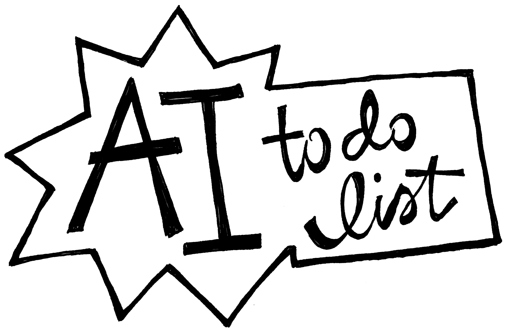
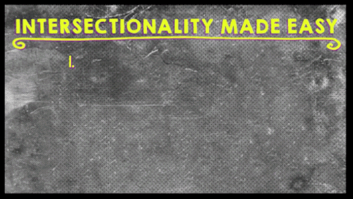
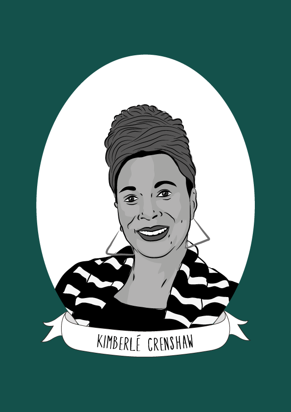

{::options parse_block_html="true" parse_span_html="true" /}

<main class="zine">
<section class="zine-page page-1" markdown="1">

# Why We Need Intersectional AI

{: .small }

#### AI is broken. What is Intersectionality and how can it help?
<!-- >(Critical Theory, So Whats) -->

<!-- --> 
<!-- duckworth intersectionality wheel? -->
  
</section>
<section class="zine-page page-2" markdown="1">

## "HOW IS AI SHIFTING POWER?”

This is the most important question to ask, rather than is this technology biased, fair, or good, says Pratyusha Ria Kalluri. They are a founder of the Radical AI Network and an AI researcher working on "ai and art that antioppressive and queerly beautiful."

Examples: 

Christina zur Nedden and Ariana Dongus reported on involuntary biometric testing on refugees entering Jordan. 

"supposedly artificial intelligence is in fact animated by global production networks of click workers," says Dongus.  

Thomas Smits and Melvin Weavers research suggests that "the agency of datasets is produced by obscuring the power and subjective choices of its creators and the countless hours of highly disciplined labour of crowd workers."

## Intersectionality Helps Us Understand Power

### What Intersectionality Is

[Laci Green](https://twitter.com/gogreen18) & [Francesca Ramsey](https://twitter.com/chescaleigh)
{: .small .float-left .mr-4 }

<!-- >"Intersectionality is a lens through which you can see where power comes and collides, where it locks and intersects. Is is the acknowledgement that everyone has their own unique experiences of discrimination and privilege." - Kimberlé Crenshaw[^Crenshaw1989] -->

Intersectionality, recently clarified by Dr. Kimberlé Crenshaw who coined the term in 1989, "deals with the interactive effects of multiple forms of discrimination—racism, patriarchy, sexism, misogyny, homophobia. [...] Most importantly, Intersectionality is a frame to tell us what's wrong with the way certain discriminations are thought about. [...] Our understanding of racism [and] sexism is incomplete if it doesn't attend to the intersection of both."[^Crenshaw2021]

"To fully understand how to do equality, [...] you have to see how institutions and vulnerabilities are structured in intersecting ways."[^Crenshaw2021]
<!-- {: .margin-above="-50px" } -->

 

"The fundamental thing to remember is that for the most part 'Isms'—racism, classism—are often framed through the experiences of those who are dominant within the group, and more times than not that's men. And because we don't understand racism as it plays out between women, or racism as creating burdens on someone that others don't have,  because we don't have that understanding, we often run up against the limitations of that frame when it's disproportionately women of a particular background or context who are being impacted by something."[^Crenshaw2021]

<!-- {: .small .float-left .mr-4 } -->

[Dr. Kimberlé Crenshaw, 2015,  Illustrated Women in History](https://illustratedwomeninhistory.com/kimberle-crenshaw-is-an-american-scholar-in-the/){: .small .float-left .mr-4 } 

"Intersectionality is an institutionalized historical advantage for white men. [...] We see hierarchy and we see the way things are supposed to be through a lens that's already intersectional. ~~It's only when there are people who are challenging that, saying it's unfair or unjust, that people see a problem [...].~~ So yes, intersectionality marks power, as well as exclusion. If we take it seriously it gives us a clue about the ways we need to rethink how our institutions function, what it values, what it should value, in order to make more equitable more institutional practices."[^Crenshaw2021]

<caption>—Dr. Kimberlé Crenshaw</caption>

"Intersectionality is actually a beautiful and brilliant tool for coalition making."[^Crenshaw2021]
<caption>—Juliana Hu Pegues</caption>

### What Intersectionality Is NOT

Intersectionality is often misunderstood: In its original formulation by Crenshaw in 1989, says Brittney Cooper (2016), it was not merely shorthand for discussing individual identity representation. Critics point out how this has allowed for even more granular marketing to these categories as they become visible to and targeted by capitalism (Chun 2018, 85). Rather, intersectionality is about power. It examines and critiques systems of power and how those systems structure themselves to impact groups and individuals unequally.

"it's an analytic tool, not a hierarchy [...] it is not identity politics on steroids"[^Crenshaw2021]

"Intersectionality is not just about identities apart from the structures that make those identities salient. [...] It's not in the body; it's in how the body is situated in the society in which we live. And that's the piece that people often get confused about."[^Crenshaw2021] 

"Intersectionality is a dynamic idea. It's not flat, it's not predetermined, it's not a formula. It's a way of seeing, it's a way of looking, it's an imperative that says if we want to be more equal we have to be better prepared to see where any inequality exists. That's what Intersectionality does, that's what it's for."[^Crenshaw2021]

"Intersectionality is contextually specific. I say it again. When we're talking about the low wages of working class women, that often includes white working class women as well. [...] Whiteness isn't protecting them from class and gender inequality in the way that whiteness sometimes provides insulation from other forms of inequality. That is the point of intersectionality. It's not a one-size-fits-all, it's not a prism that always predicts who's on top and who's on bottom."[^Crenshaw2021]

<iframe src="https://www.npr.org/player/embed/982357959/982371588" width="100%" height="290" frameborder="0" scrolling="no" title="NPR embedded audio player"></iframe>

[^Crenshaw1989]: Crenshaw, K. (2015). Demarginalizing the Intersection of Race and Sex: A Black Feminist Critique of Antidiscrimination Doctrine, Feminist Theory and Antiracist Politics. University of Chicago Legal Forum, 1989(1). https://chicagounbound.uchicago.edu/uclf/vol1989/iss1/8
[^Crenshaw2021]: Crenshaw, K. (2021, March 29). What Does Intersectionality Mean? : 1A. https://www.npr.org/2021/03/29/982357959/what-does-intersectionality-mean

</section>

<section class="zine-page page-3" markdown="1">

## What Intersectionality Offers to Technology

Catherine D’Ignazio and Lauren Klein (2019) agree that intersectionality not only describes different aspects of an individual’s position, but also “intersecting forces of privilege and oppression at work in a given society. Oppression involves the systematic mistreatment of certain groups of people by other groups. It happens when power is not distributed equally” (7–-8). Intersectional feminism insists on not just meeting the needs of the most priviledged (white) women when arguing for feminism, or the needs of only Black men when combating anti-Blackness, but instead suggests that those with overlapping oppressions such as Black women face unique additional oppression; by addressing their circumstances, for example, life improves for everyone.

Jacqueline Wernimont (2018) uses the metaphor of a matrix, as in, “the media in which something is generated or developed. As a generative form, the matrix is a powerful way of understanding and critiquing binary logics and simple, progressive narratives” (11). Citing Vivian M. May, she says it also grounds intersectional practice and thought, “intersectional work focuses on ‘enmeshed multiplicities,’ including but not limited to those of race and gender. It also entails a commitment to ‘resistant forms of knowing’ […]. The matrix logic of intersectional feminism ‘considers how inequalities intermingle,’ and stresses linkages between ‘the structural and experiential, and the material and the discursive’” (11). This suggests how intersectionality could offer a different lens through which to approach AI and technology in general. Intersectional AI as sketched out here is indebted to Crenshaw’s original definition, as well as the concept’s long lineages within Black and indigenous thought, for its critical lens to analyze technology and for its creative approach to redesigning it.

### Critical lenses

>"there is no “neutral,” “natural,” or “apolitical” vantage point that training data can be built upon. There is no easy technical “fix” by shifting demographics, deleting offensive terms, or seeking equal representation by skin tone. The whole endeavor of collecting images, categorizing them, and labeling them is itself a form of politics, filled with questions about who gets to decide what images mean and what kinds of social and political work those representations perform." (Crawford & Paglen "Excavating AI" 2019)

### Practical tactics

### A meta-ethics of multiplicity

*see tactics issue*

</section>

<section class="zine-page page-4" markdown="1">

### From inclusion to decentering
*expand... Representation is not enough; labor is present but unseen, in global south and undervalued. Not about code bootcamps but valued voices.*[source]() Dunbar-Hester, et al

Guillermo Gómez-Peña says the high-tech world does not question itself as central, nor where it draws its borders: “We are no longer trying to persuade anyone that we are worthy of inclusion (we are de facto insiders/outsiders at the same time, or temporary insiders perhaps, and we know it). […] What we wish is to remap the hegemonic cartography of cyberspace; to “politicize” the debate; to develop a multi centric theoretical understanding of the cultural, political and aesthetic possibilities of new technologies; to exchange a different sort of information (mytho poetical, activist, per formative, imagistic) […].”3

Importantly, Christina Dunbar-Hester (2020) argues that “diversity and inclusion” fixes completely miss the problem—not only because it ignores the workers of the Global South[^gs] but also because it reverses the problem’s cause and effect: “to frame social inequality as a question of diversity in technological production, and to expect to change wider inequities by adding ‘diverse’ individuals to technical cultures, is to misunderstand how the distribution of various social identities in a given sector are outgrowths of differential social power, not the other way around” (16).

By a similar logic, removing bias from algorithmic systems—even if that were possible (which, no.)—does not remove bias from culture, nor does it replace it with anything. Often, even well-meaning efforts to “remove” bias from systems fall back on quantitative / computational methods or resort to representation, which mirror the problems they claim to address, potentially even making tools to be misused in the future: “Representation as a goal may also result in accepting (and reproducing) notions of fixity in terms of social identity. This should raise skepticism” (236). These approaches do not examine the structure of the system itself, the logic upon which it is founded, both materially and intellectually. They do not ask who is creating, contributing, or benefitting from its operation. “Diversity [and, I argue, bias examination] is necessary, but not sufficient; it represents a shortcut in what should be a deeper conversation about values and justice” (Dunbar-Hester 2020, 241).
</section>
<section class="zine-page page-5" markdown="1">

## What does it mean to say "Race Is A Technology?"
[source]() Lisa Nakamura, Wendy Chun, et al
Race as algorithm, Sareeta Amrute

Ruja Benjamin, author of Race After Technology (2019), says, “this is an invitation to consider racism in relation to other forms of domination as not just an ideology or history, but as a set of technologies that generate patterns of social relations, and these become Black-boxed as natural, inevitable, automatic. As such, this is also an invitation to refuse the illusion of inevitability in which technologies of race come wrapped” (23).

### Algorithmic histories predict futures
*expand* [source]() Dark Matters, et al
“Codes are both reflective and predictive. They have a past and a future,” (3) says Benjamin. She uses race critical code studies (see p7) to show how race itself is a technology that has been used to discriminate, even in decision-making processes that appear “neutral” or outside the scope of algorithms: “even just deciding what problem needs solving requires a host of judgments” (5).

“Data for Black Lives co-founder Yeshimabeit Milner reminds us that “[t]he decision to make every Black life count as three-fifths of a person was embedded in the electoral college, an algorithm that continues to be the basis of our current democracy.” (5)

</section>
<section class="zine-page page-6" markdown="1">

### Alternative histories & approaches
[source]() **expand: Xin Xin is working on this section and labor essay**

The algorithm itself is an ancient, not exclusive to high-tech startups. “[C]laiming that abstract techniques of knowledge and artificial metalanguages belong uniquely to the modern industrial West is not only historically inaccurate but also an act and one of implicit epistemic colonialism towards cultures of other places and other times. […A]lgorithms are among the most ancient and material practices, predating many human tools and all modern machines” (Pasquinelli 2019). Instead of assuming AI must be how it is, it’s worth asking what other cultural values might come with algorithms from other cultures (not to appropriate those, but rather to decenter the supremacy of white neoliberal ways of knowing).

</section>
<section class="zine-page page-7" markdown="1">

## Whiteness & AI

Benjamin argues that, “what appears to be an absence in terms of being ‘cultureless’ works more like a superpower. Invisibility, with regard to Whiteness, offers immunity. To be unmarked by race allows you to reap the benefits but escape responsibility for your role in an unjust system” (2). Although invisible, whiteness is a determining factor shaping AI, “structuring whose literal voice gets embodied in AI. In celebrating diversity, tokenistic approaches to tech development fail to acknowledge how the White aesthetic colors AI. The ‘blandness’ of Whiteness […] is treated by programmers as normal, universal, and appealing” (15).

### Characteristics of white supremacy culture

The zine “Characteristics of White Supremacy Culture” by [Tema Okun](dismantlingracism.org/uploads/4/3/5/7/43579015/whitesupcul13.pdf) details traits that permate the broader culture (and tech culture). They don’t feel good, and avoiding them in life and when designing and implementing intersectional technology sounds like such a great idea:

- ~~perfectionism~~
- ~~sense of urgency~~
- ~~defensiveness~~
- ~~quantity over quality~~
- ~~worship of the written word~~
- ~~only one right way~~
- ~~paternalism~~
- ~~either/or thinking~~
- ~~power hoarding~~
- ~~fear of open conflict~~
- ~~individualism~~
- ~~progress is bigger, more~~
- ~~objectivity~~
- ~~right to comfort~~

Do you see these values in the digital objects and services you use now? How can you imagine them operating differently? What values would you replace them with?

[zine] (link TK?)

</section>
<section class="zine-page page-8" markdown="1">

### The reach of AI requires Intersectionality at every level

In “Anatomy of an AI System,” Kate Crawford and Vladan Joler (2018) map out the vast tangible effects of convenient, immaterial-seeming AI that require: “a vast planetary network, fueled by the extraction of non-renewable materials, labor, and data. […] it is hard to ‘see’ any of these processes individually, let alone collectively.” And understanding isn’t enough, they argue, “without forms of real choice, and corporate accountability, mere transparency won’t shift the weight of the current power asymmetries.”

“To the casual observer, it looks like it has never been easier to build AI [creating] a false idea of the ‘democratization’ of AI. While ‘off the shelf’ machine learning tools, like TensorFlow, are becoming more accessible from the point of view of setting up your own system, the underlying logics of those systems, and the datasets for training them are accessible to and controlled by very few entities. In the dynamic of dataset collection through platforms like Facebook, users are feeding and training the neural networks with behavioral data, voice, tagged pictures and videos or medical data. In an era of extractivism, the real value of that data is controlled and exploited by the very few at the top of the pyramid.” (Crawford/Joler 2018)

#### Sources

#### Issues in this zine collection
<!--visit site-->

</section>
</main>

<section class="no-print">
## Missing
Who do we mean, what theories to focus on

## Where to include these? 

### Race-Critical Code Studies

Critical code studies is an approach that suggests reading the code itself for its style, the influences of its authors and the choices they make, just like any other kind of writing: “lines of code are not value-neutral and can be analyzed using the theoretical approaches applied to other [texts] in addition to particular interpretive methods developed particularly for the discussions of programs” (Marino 2006). Because so much of coding originates not from a blank screen but adapts existing scripts and examples, being able to parse code both technically and critically is essential. Ruja Benjamin (2019) combines this approach with critical race theory for her “race critical code studies” methodology, which looks “at how race and racism impact who has access to new devices, as well as how technologies are produced in the first place” (22).

### Restorative Processing, infrastructures of care

Intersectional AI must be not just about remedying bias but more broadly about instituting infrastructures of care. For what and for whom do we truly care? And how do we demonstrate those values by reorienting (after Sara Ahmed) ourselves, our attention, our resources? Along with all of the harm caused by technological and cultural bias, framing these issues in the positive rather than the negative makes this a question, not just of what to remove, but of what to build in its place.

</section>

<!-- new sources added -->

*[click workers]: Dongus, A. The Living Pixel: An alternative feminist-materialist geneology of the emergence of computer-vision." SFKP Journal. (German) https://sfkp.ch/artikel/die-lebendigen-pixel
*[involuntary biometric testing]: zur Nedden, C. and Dongus, A. 2017. Tested on Millions of people involuntarily. Zeit Online. https://www.zeit.de/digital/datenschutz/2017-12/biometrie-fluechtlinge-cpams-iris-erkennung-zwang
[Smits]: Smits, T., & Wevers, M. (2021). The agency of computer vision models as optical instruments. Visual Communication, 1470357221992097. https://doi.org/10.1177/1470357221992097
*[Kalluri]: http://riakalluri.com/
*[shifting power]: https://www.nature.com/articles/d41586-020-02003-2
*[white supremacy culture]: https://www.whitesupremacyculture.info/

<!-- footnotes -->
[^gs]: Lisa Nakamura, Sarah T. Roberts, and others have pointed to the many female and BIPOC tech workers who go unrecognized because their work is not the glamor work of tech, from the physically-taxing work of chip manufacturing on New Mexico reservations to the emotionally-taxing work of content moderation at sites just-off big tech campuses. Christina Dunbar-Hester (2020) argues that even “hacking has never been centered exclusively around white men in the Global North. Furthermore, some of what is required here is to simply shift the frame of what counts as hacking: to redraw boundaries to place social and historical analysis and infrastructural care work within the purview of hacking. In combination, these analytical adjustments can illuminate the ‘others’ of hacking—who are already here” (242).

<!-- References -->
<!-- field3 -->
*[Ahmed]: Ahmed, Sara. 2006. Queer Phenomenology; —. 2017. Living a Feminist Life.
*[Adam]: Adam, Alison. 1998. Artificial Knowing: Gender and the Thinking Machine.
*[Apprich]: Apprich, Clemens, Wendy Hui Kyong Chun, Florian Cramer, & Hito Steyerl. 2018. Pattern Discrimination.
*[Benjamin]: Benjamin, Ruha. 2019. _Race After Technology: Abolitionist Tools for the New Jim Code._
*[D’Ignazio & Klein]: D’Ignazio, Catherine, and Lauren Klein. 2019. Data Feminism.
*[Klein]: D’Ignazio, Catherine, and Lauren Klein. 2019. _Data Feminism_; Posner, Miriam and Lauren Klein. 2017. “Data as Media.” _Feminist Media Histories_.
*[Dunbar-Hester]: Dunbar-Hester, Christina. 2020. _Hacking Diversity: The Politics of Inclusion in Open Technology Cultures._
*[McPherson]: McPherson, Tara. 2018. _Feminist in a Software Lab._ 
*[Noble]: Noble, Safiya Umoja. 2018. _Algorithms of Oppression._
*[Phillips]: Phillips, Whitney. 2016. _This Is Why We Can’t Have Nice Things_; --. 2018. “Am I Why I Can’t Have Nice Things? A Reflection on Personal Trauma, Networked Play, and Ethical Sight.” A Networked Self and Love. ed. Zizi Papacharissi.
*[Plant]: Plant, Sadie. 1998. Zeros + Ones. 
*[Preciado]: Preciado, Paul. 2018. Countersexual Manifesto.
*[Raley]: Raley, Rita. 2006. “Code.surface || Code.depth.” dichtung-digital.; 2009. Tactical Media.; 2013. “Dataveillance and Countervailance.” Raw Data is an Oxymoron.; 2018. “LOVE.ABZ AND THE TASK OF THE MACHINE TRANSLATOR - An Interview with Otso Huopaniemi.” AModern. https://amodern.net/article/love-abz/
*[Wilson]: Wilson, Elizabeth. 2010. Affect and Artificial Intelligence.
*[Butler]: Butler, Judith. 1988. “Performative Acts and Gender Constitution.” Theatre Journal.
*[Cho]: Cho, Alexander. 2015. “Queer Reverb.” Networked Affect. Hillis, Ken, et al, eds.
*[Cooper]: Cooper, Brittney. 2016. “Intersectionality.” In The Oxford Handbook of Feminist Theory.
*[Crawford]: Crawford, Kate, and Vladan Joler. 2018. “Anatomy of an AI System.” SHARE Lab, SHARE Foundation and AI Institute.; Stark, Luke, and Kate Crawford. 2015. "The Conservatism of Emoji: Work, Affect, and Communication." _Social Media and Society_.
*[Chun]: Chun, Wendy Hui Kyong. 2016. _Updating to Remain the Same_.; 2009. “Race and/as Technology.” Camera Obscura 70. 24:1.; Apprich, Clemens, Wendy Hui Kyong Chun, Florian Cramer, & Hito Steyerl. 2018. Pattern Discrimination.
*[Daniels]: Daniels, Jessie. 2009. “Rethinking Cyberfeminism(s): Race, Gender, and Embodiment.” Women’s Studies Quarterly.
*[Gaboury]: Gaboury, Jacob. “Becoming NULL: Queer Relations in the Excluded Middle.” Women & Performance: A Journal of Feminist Theory.
*[Gómez-Peña]: Gómez-Peña, Guillermo. “The Virtual Barrio @ The Other Frontier.”
*[Haraway]: Haraway, Donna. 1991. “A Cyborg Manifesto.” Simians, Cyborgs and Women.
*[Keeling]: Keeling, Kara. 2014. “Queer OS.” Cinema Journal.
*[Nakamura]: Nakamura, Lisa. 2014. “Indigenous Circuits: Navajo Women and the Racialization of Early Electronic Manufacture.” American Quarterly, 66:4.
*[Schmidt]: Schmidt, Anna, and Michael Wiegand. 2017. “A Survey on Hate Speech Detection Using Natural Language Processing.” In Proceedings of the Fifth International Workshop on Natural Language Processing for Social Media.
*[Sundén]: Sundén, Jenny. 2018 “Queer Disconnections: Affect, Break, and Delay in Digital Connectivity.” Transformations 31:4. 
*[Steyerl]: Apprich, Clemens, Wendy Hui Kyong Chun, Florian Cramer, & Hito Steyerl. 2018. Pattern Discrimination.
*[Sweeney]: Sweeney, Miriam E. 2016. “The Intersectional Interface.” In The Intersectional Internet: Race, Sex, Class and Culture Online.
